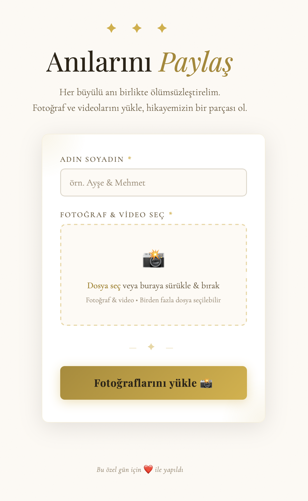

# 💍 Wedding Media Collection App



🔗 [**Live Demo**](https://wedding-web-nine-orpin.vercel.app)

An elegant, mobile-first, single-page web application designed for
ephemeral serverless media collection. This project allows wedding
guests to easily upload high-resolution photos and large videos directly
from their mobile devices via a QR code, bypassing the friction of
creating accounts or downloading dedicated apps.

------------------------------------------------------------------------

## 🏗 Architecture Overview

This project utilizes a **Database-less Serverless Architecture**:

-   **Frontend:** Built entirely in a single `index.html` file using
    Vanilla HTML, CSS, and JavaScript. No build steps (Webpack/Vite) or
    heavy frameworks (React/Vue) are required.
-   **Backend:** Firebase Cloud Storage via the v10 Modular CDN.
-   **Metadata Tracking:** Instead of using a NoSQL database to track
    uploads, user metadata is embedded directly into the file string
    upon upload:\
    `[GuestName]_[Timestamp]_[OriginalFileName]`

------------------------------------------------------------------------

## 🚀 Step 1: Firebase Setup

To use this application, you must configure a Firebase project to act as
your storage bucket.

1.  Navigate to the Firebase Console and create a new project.
2.  Disable Google Analytics (not needed for a single-day event).
3.  Once the project is created, click the Web icon (`</>`) to register
    your application.
4.  Copy the `firebaseConfig` object provided by Google.

### 🔧 Configuring the Frontend

Open `index.html` and locate the configuration placeholder inside the
`<script type="module">` tag. Paste your keys:

``` javascript
const firebaseConfig = {
  apiKey: "YOUR_API_KEY",
  authDomain: "your-project.firebaseapp.com",
  projectId: "your-project",
  storageBucket: "your-project.firebasestorage.app",
  messagingSenderId: "YOUR_SENDER_ID",
  appId: "YOUR_APP_ID"
};
```

------------------------------------------------------------------------

## 🛡 Step 2: Storage Security Rules

Because this application allows anonymous uploads via a public QR code,
you must configure strict Security Rules to prevent guests from deleting
or overwriting files.

1.  In the Firebase Console, navigate to **Build \> Storage**.
2.  Click **Get Started** to initialize your bucket.
3.  Go to the **Rules** tab.
4.  Replace the default rules with the following configuration:

``` javascript
rules_version = '2';
service firebase.storage {
  match /b/{bucket}/o {
    // Restrict access specifically to the wedding-uploads folder
    match /wedding-uploads/{allPaths=**} {

      // ANYONE can upload new files
      allow create: if true;

      // ANYONE can view the gallery (if implemented)
      allow read: if true;

      // CRITICAL: Prevent accidental or malicious file deletion
      allow update, delete: if false;
    }
  }
}
```

5.  Click **Publish** to apply the rules.

------------------------------------------------------------------------

## 🌐 Step 3: CORS Configuration (Critical)

To allow direct uploads from your deployed website (e.g., Vercel or
GitHub Pages) to Google Cloud Storage, you must configure **CORS**.

### Create CORS config:

``` bash
echo '[{"origin": ["*"], "method": ["GET", "PUT", "POST"], "maxAgeSeconds": 3600}]' > cors.json
```

### Apply to bucket:

``` bash
gsutil cors set cors.json gs://your-project.firebasestorage.app
```

------------------------------------------------------------------------

## ⚡ Step 4: Deployment to Vercel

### Method A: Dashboard

1.  Push this repository to GitHub.
2.  Go to Vercel → **Add New \> Project**
3.  Import your repository.
4.  Leave settings as default.
5.  Click **Deploy**

### Method B: CLI

``` bash
# Install Vercel CLI
npm i -g vercel

# Login
vercel login

# Deploy
vercel --prod
```

------------------------------------------------------------------------

## 📱 Bonus: Generate a QR Code

### Install dependency:

``` bash
pip install "qrcode[pil]"
```

### Python script:

``` python
import qrcode

website_url = "https://your-vercel-deployment-url.vercel.app"

qr = qrcode.QRCode(
    version=1,
    error_correction=qrcode.constants.ERROR_CORRECT_H, 
    box_size=10,
    border=4,
)

qr.add_data(website_url)
qr.make(fit=True)

img = qr.make_image(fill_color="black", back_color="white")
img.save("wedding_qr_code.png")

print("QR Code generated successfully!")
```

Place `wedding_qr_code.png` on tables or at the entrance for guests to
scan and upload their memories.
